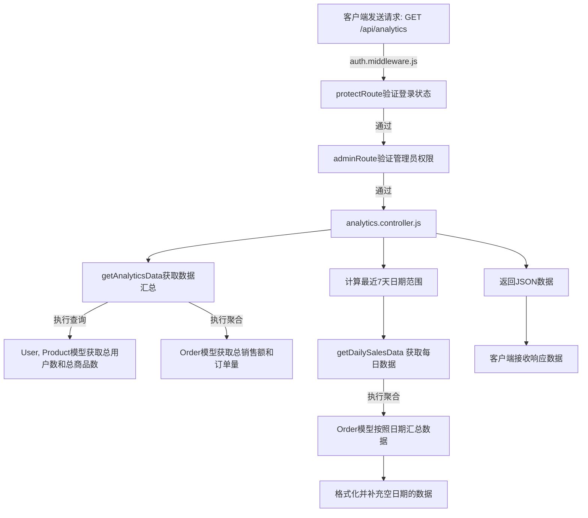
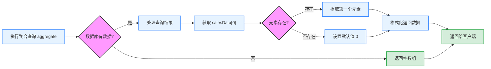
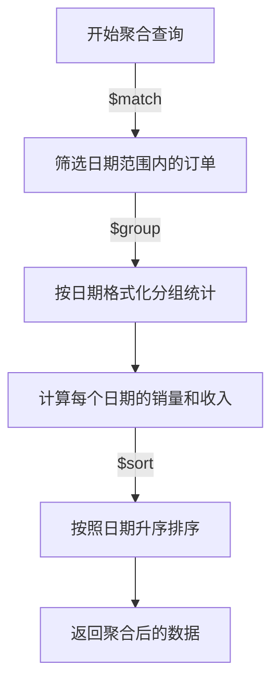

```mermaid
graph TD
A[客户端发送请求: GET /api/analytics] -->|auth.middleware.js| B[protectRoute验证登录状态]
B -->|通过| C[adminRoute验证管理员权限]
C -->|通过| D[analytics.controller.js]
D --> E[getAnalyticsData获取数据汇总]
E -->|执行查询| F[User, Product模型获取总用户数和总商品数]
E -->|执行聚合| G[Order模型获取总销售额和订单量]
D --> H[计算最近7天日期范围]
H --> I[getDailySalesData 获取每日数据]
I -->|执行聚合| J[Order模型按照日期汇总数据]
J --> K[格式化并补充空日期的数据]
D --> L[返回JSON数据]
L --> M[客户端接收响应数据]

```

```mermaid
graph LR
    A[执行聚合查询 aggregate] --> B{数据库有数据?}
    B -- 是 --> C[处理查询结果]
    B -- 否 --> D[返回空数组]
    C --> E["获取 salesData[0]"]
    E --> F{元素存在?}
    F -- 存在 --> G[提取第一个元素]
    F -- 不存在 --> H[设置默认值 0]
    G --> I[格式化返回数据]
    H --> I
    I --> J[返回给客户端]
    D --> J

    classDef decision fill:#f9f,stroke:#333,stroke-width:2px;
    classDef process fill:#e6f3ff,stroke:#3385ff,stroke-width:2px;
    classDef endpoint fill:#d4edda,stroke:#28a745,stroke-width:2px;

    class B,F decision;
    class A,C,E,G,H,I process;
    class D,J endpoint;
```

```mermaid
graph TD
A[开始聚合查询] -->|$match| B[筛选日期范围内的订单]
B -->|$group| C[按日期格式化分组统计]
C --> D[计算每个日期的销量和收入]
D -->|$sort| E[按照日期升序排序]
E --> F[返回聚合后的数据]

```
