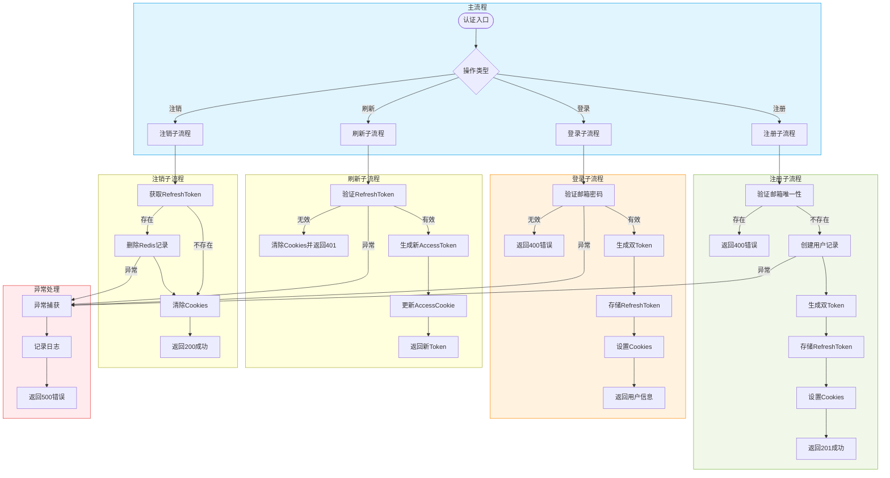

```mermaid
flowchart TD
    subgraph 注册流程[用户注册/signup]
        A1([开始]) --> B1[获取name, email, password]
        B1 --> C1{用户是否存在?}
        C1 -->|是| D1[返回400错误]
        C1 -->|否| E1[创建用户]
        E1 --> F1[生成AccessToken和RefreshToken]
        F1 --> G1[存储RefreshToken到Redis]
        G1 --> H1[设置Cookies]
        H1 --> I1[返回用户信息201]
        C1 --> J1[数据库错误]
        E1 --> J1
        J1 --> K1[返回500错误]
    end

    subgraph 登录流程[用户登录/login]
        A2([开始]) --> B2[获取email, password]
        B2 --> C2{用户存在且密码正确?}
        C2 -->|是| D2[生成Tokens]
        D2 --> E2[存储RefreshToken到Redis]
        E2 --> F2[设置Cookies]
        F2 --> G2[返回用户信息200]
        C2 -->|否| H2[返回400错误]
        B2 --> I2[数据库错误]
        C2 --> I2
        I2 --> J2[返回500错误]
    end

    subgraph 注销流程[用户注销/logout]
        A3([开始]) --> B3[获取RefreshToken]
        B3 --> C3{Token存在?}
        C3 -->|是| D3[验证并删除Redis条目]
        C3 -->|否| E3[清除Cookies]
        D3 --> E3
        E3 --> F3[返回成功200]
        B3 --> G3[Token验证失败]
        D3 --> G3
        G3 --> H3[返回500错误]
    end

    style A1 fill:#9f9,stroke:#333
    style A2 fill:#9f9,stroke:#333
    style A3 fill:#9f9,stroke:#333
    style K1,J2,H3 fill:#f99,stroke:#333
```

```mermaid
flowchart TD
    subgraph 主流程
        A([认证入口]) --> B{操作类型}
        B -->|注册| C[注册子流程]
        B -->|登录| D[登录子流程]
        B -->|刷新| E[刷新子流程]
        B -->|注销| F[注销子流程]
    end

    subgraph 注册子流程
        C --> C1[验证邮箱唯一性]
        C1 -->|存在| C2[返回400错误]
        C1 -->|不存在| C3[创建用户记录]
        C3 --> C4[生成双Token]
        C4 --> C5[存储RefreshToken]
        C5 --> C6[设置Cookies]
        C6 --> C7[返回201成功]
    end

    subgraph 登录子流程
        D --> D1[验证邮箱密码]
        D1 -->|无效| D2[返回400错误]
        D1 -->|有效| D3[生成双Token]
        D3 --> D4[存储RefreshToken]
        D4 --> D5[设置Cookies]
        D5 --> D6[返回用户信息]
    end

    subgraph 刷新子流程
        E --> E1[验证RefreshToken]
        E1 -->|无效| E2[清除Cookies并返回401]
        E1 -->|有效| E3[生成新AccessToken]
        E3 --> E4[更新AccessCookie]
        E4 --> E5[返回新Token]
    end

    subgraph 注销子流程
        F --> F1[获取RefreshToken]
        F1 -->|存在| F2[删除Redis记录]
        F2 --> F3[清除Cookies]
        F1 -->|不存在| F3
        F3 --> F4[返回200成功]
    end

    subgraph 异常处理
        exception[异常捕获] --> log[记录日志]
        log --> response[返回500错误]
    end

    C3 & D1 & E1 & F2 -->|异常| exception
    style 主流程 fill:#E1F5FE,stroke:#039BE5
    style 注册子流程 fill:#F1F8E9,stroke:#7CB342
    style 登录子流程 fill:#FFF3E0,stroke:#FB8C00
    style 异常处理 fill:#FFEBEE,stroke:#E53935
```
