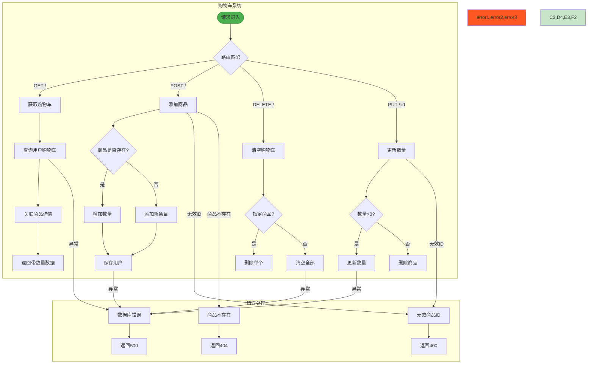
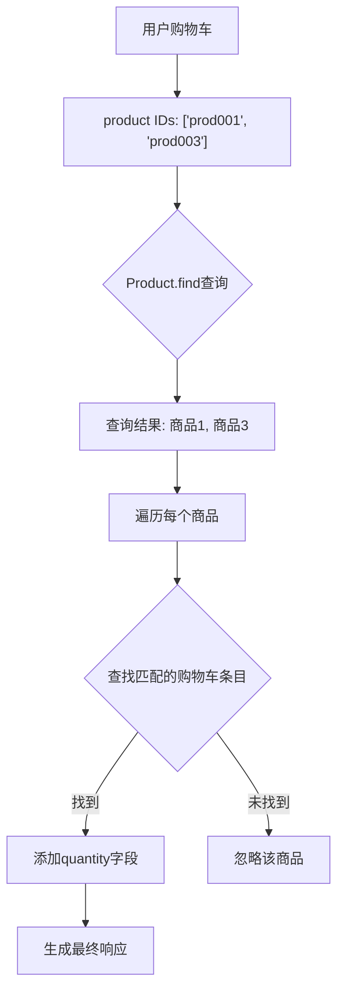
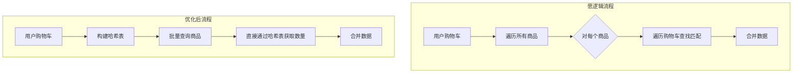

```mermaid
flowchart TD
    subgraph 购物车系统
        A([请求进入]) --> B{路由匹配}

        B -->|GET /| C[获取购物车]
        B -->|POST /| D[添加商品]
        B -->|DELETE /| E[清空购物车]
        B -->|PUT /:id| F[更新数量]

        C --> C1[查询用户购物车]
        C1 --> C2[关联商品详情]
        C2 --> C3[返回带数量数据]

        D --> D1{商品是否存在?}
        D1 -->|是| D2[增加数量]
        D1 -->|否| D3[添加新条目]
        D2 & D3 --> D4[保存用户]

        E --> E1{指定商品?}
        E1 -->|是| E2[删除单个]
        E1 -->|否| E3[清空全部]

        F --> F1{数量>0?}
        F1 -->|是| F2[更新数量]
        F1 -->|否| F3[删除商品]
    end

    subgraph 错误处理
        error1[无效商品ID] --> res1[返回400]
        error2[商品不存在] --> res2[返回404]
        error3[数据库错误] --> res3[返回500]
    end

    D & F -->|无效ID| error1
    D -->|商品不存在| error2
    C1 & D4 & E3 & F2 -->|异常| error3

    style A fill:#4CAF50,stroke:#388E3C
    style error1,error2,error3 fill:#FF5722
    style C3,D4,E3,F2 fill:#C8E6C9
```

```mermaid
flowchart TD
    A[用户购物车] --> B["product IDs: ['prod001', 'prod003']"]
    B --> C{Product.find查询}
    C --> D["查询结果: 商品1, 商品3"]
    D --> E[遍历每个商品]
    E --> F{查找匹配的购物车条目}
    F -->|找到| G[添加quantity字段]
    F -->|未找到| H[忽略该商品]
    G --> I[生成最终响应]
```

```mermaid
flowchart TD
    subgraph 愿逻辑流程
        A1[用户购物车] --> B1[遍历所有商品]
        B1 --> C1{对每个商品}
        C1 --> D1[遍历购物车查找匹配]
        D1 --> E1[合并数据]
    end

    subgraph 优化后流程
        A2[用户购物车] --> B2[构建哈希表]
        B2 --> C2[批量查询商品]
        C2 --> D2[直接通过哈希表获取数量]
        D2 --> E2[合并数据]
    end
```
