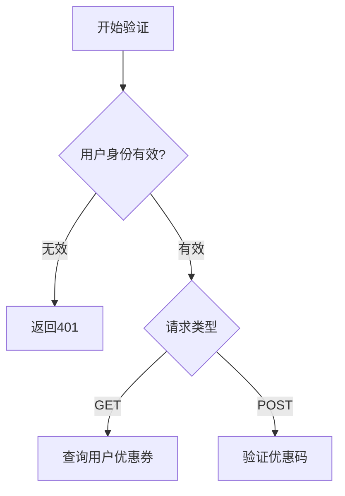
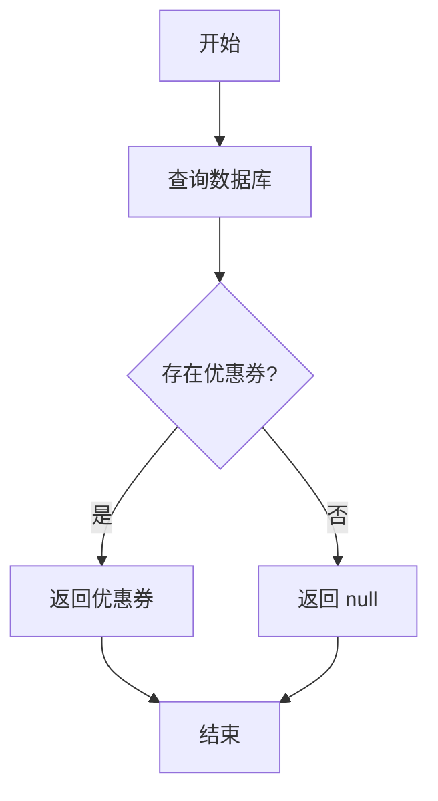
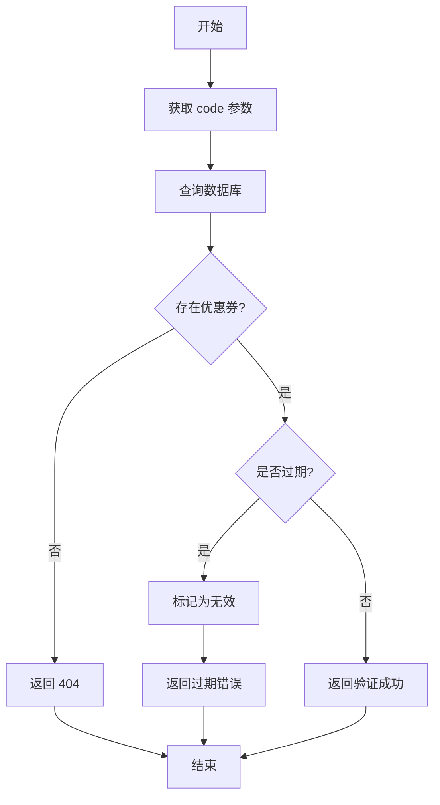

## 优惠券路由流程图

```mermaid
graph TD
    A[开始验证] --> B{用户身份有效?}
    B -->|无效| C[返回401]
    B -->|有效| D{请求类型}
    D -->|GET| E[查询用户优惠券]
    D -->|POST| F[验证优惠码]
```

### ​GET / 处理流程：

```mermaid
graph TD
A[开始] --> B[查询数据库]
B --> C{存在优惠券?}
C -->|是| D[返回优惠券]
C -->|否| E[返回 null]
D --> F[结束]
E --> F
```

### ​POST /validate 处理流程：

```mermaid
graph TD
A[开始] --> B[获取 code 参数]
B --> C[查询数据库]
C --> D{存在优惠券?}
D -->|否| E[返回 404]
D -->|是| F{是否过期?}
F -->|是| G[标记为无效]
G --> H[返回过期错误]
F -->|否| I[返回验证成功]
E --> J[结束]
H --> J
I --> J
```
