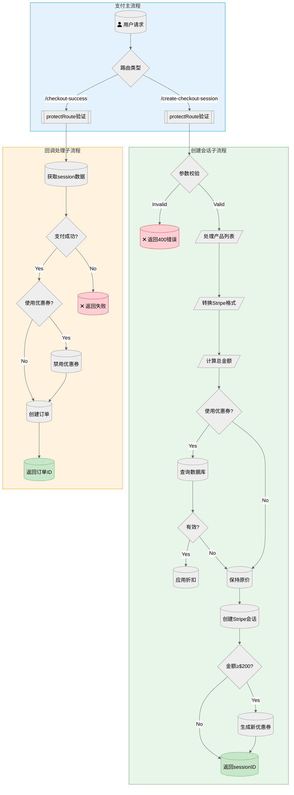

```mermaid
%%{init: {'securityLevel': 'loose', 'theme': 'neutral'}}%%
flowchart TD
    subgraph main["支付主流程"]
        A[("fa:fa-user 用户请求")] --> B{路由类型}
        B -->|/create-checkout-session| C
        B -->|/checkout-success| D
    end

    subgraph create["创建会话子流程"]
        C[["protectRoute验证"]] --> C1{"参数校验"}
        C1 -->|Invalid| C2[("fa:fa-times 返回400错误")]
        C1 -->|Valid| C3[/"处理产品列表"/]

        C3 --> C4[/"转换Stripe格式"/]
        C4 --> C5[/"计算总金额"/]

        C5 --> C6{"使用优惠券?"}
        C6 -->|Yes| C7[("查询数据库")]
        C7 --> C8{"有效?"}
        C8 -->|Yes| C9[("应用折扣")]
        C8 -->|No| C10[("保持原价")]
        C6 -->|No| C10

        C10 --> C11[("创建Stripe会话")]
        C11 --> C12{"金额≥$200?"}
        C12 -->|Yes| C13[("生成新优惠券")]
        C12 -->|No| C14[("返回sessionID")]
        C13 --> C14
    end

    subgraph callback["回调处理子流程"]
        D[["protectRoute验证"]] --> D1[("获取session数据")]
        D1 --> D2{"支付成功?"}
        D2 -->|Yes| D3{"使用优惠券?"}
        D3 -->|Yes| D4[("禁用优惠券")]
        D3 -->|No| D5[("创建订单")]
        D4 --> D5
        D5 --> D6[("返回订单ID")]
        D2 -->|No| D7[("fa:fa-times 返回失败")]
    end

    style main fill:#e3f2fd,stroke:#2196f3
    style create fill:#e8f5e9,stroke:#4caf50
    style callback fill:#fff3e0,stroke:#ffa726
    style C2 fill:#ffcdd2,stroke:#ef5350
    style C14 fill:#c8e6c9,stroke:#66bb6a
    style D6 fill:#c8e6c9,stroke:#66bb6a
    style D7 fill:#ffcdd2,stroke:#ef5350
```
