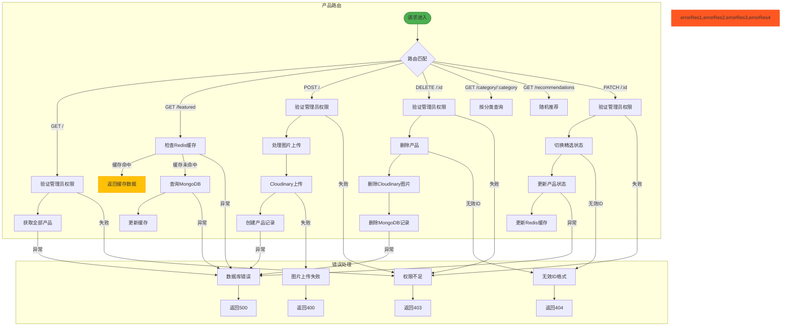

```mermaid
flowchart TD
    subgraph 产品路由
        A([请求进入]) --> B{路由匹配}

        B -->|GET /| C[验证管理员权限] --> D[获取全部产品]
        B -->|GET /featured| E[检查Redis缓存]
        B -->|POST /| F[验证管理员权限] --> G[处理图片上传]
        B -->|DELETE /:id| H[验证管理员权限] --> I[删除产品]
        B -->|GET /category/:category| J[按分类查询]
        B -->|GET /recommendations| K[随机推荐]
        B -->|PATCH /:id| L[验证管理员权限] --> M[切换精选状态]

        E -->|缓存命中| N[返回缓存数据]
        E -->|缓存未命中| O[查询MongoDB] --> P[更新缓存]

        G --> Q[Cloudinary上传] --> R[创建产品记录]

        I --> S[删除Cloudinary图片] --> T[删除MongoDB记录]

        M --> U[更新产品状态] --> V[更新Redis缓存]
    end

    subgraph 错误处理
        error1[权限不足] --> errorRes1[返回403]
        error2[图片上传失败] --> errorRes2[返回400]
        error3[数据库错误] --> errorRes3[返回500]
        error4[无效ID格式] --> errorRes4[返回404]
    end

    C & F & H & L -->|失败| error1
    Q -->|失败| error2
    D & E & O & R & T & U -->|异常| error3
    I & M -->|无效ID| error4

    style A fill:#4CAF50,stroke:#388E3C
    style errorRes1,errorRes2,errorRes3,errorRes4 fill:#FF5722,stroke:#E64A19
    style N fill:#FFC107,stroke:#FFA000
```
